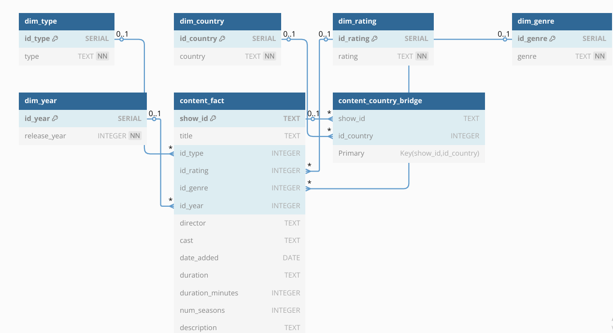

# Netflix Analytics Pipeline

Este proyecto construye un pipeline completo de ingesta, modelado y análisis de datos sobre el catálogo de Netflix, con el objetivo de facilitar el análisis exploratorio y la generación de dashboards a partir de una arquitectura de datos robusta.

##  Objetivos

- Automatizar la carga y transformación de datos de Netflix.
- Modelar los datos usando un esquema estrella en PostgreSQL.
- Generar datasets listos para análisis y visualización.
- Extraer insights mediante notebooks analíticos y clustering no supervisado.

---

##  Estructura del Proyecto

```
meli_netflix_pipeline/
│
├── .env                     # Variables de entorno (conexión a PostgreSQL, API keys)
├── requirements.txt         # Dependencias del proyecto
│
├── run_pipeline.py          # Script maestro: carga, transformación y exportación
├── validate_model.py        # Validaciones de integridad del modelo estrella
│
├── sql/
│   ├── 01_create_schema.sql
│   ├── 02_create_raw_titles.sql
│   ├── 03_transform_clean.sql
│   ├── 04_star_schema.sql
│   ├── 05_insert_dimensions.sql
│   ├── 06_insert_fact.sql
│   └── 07_insert_country_bridge.sql
│
├── export_csv.py            # Exporta dataset consolidado para el dashboard
├── notebooks/
│   ├── Parte 3 Analisis Avanzado.ipynb
│   └── Parte 4 OpenAI.ipynb
│
├── netflix_dash_ready.csv   # Dataset granular listo para dashboards
└── netflix_global_unique.csv # Dataset normalizado (un registro por título)
```

---

##  Lógica del Modelo Estrella

- `content_fact`: Tabla de hechos con títulos, duración, director, etc.
- `dim_type`, `dim_rating`, `dim_genre`, `dim_year`, `dim_country`: Dimensiones para facilitar el análisis por atributos categóricos.
- `content_country_bridge`: Tabla puente para manejar la relación muchos-a-muchos entre títulos y países.

Diagrama completo en : 

---

##  Cómo Ejecutarlo

1. Clona el repositorio:
   ```bash
   git clone https://github.com/SetoroUnal/netflix-analytics-pipeline.git
   cd netflix-analytics-pipeline
   ```

2. Configura tu `.env`:
   ```
   DB_USER=...
   DB_PASSWORD=...
   DB_HOST=localhost
   DB_NAME=netflix_db
   DB_PORT=5432
   ```

3. Instala dependencias:
   ```bash
   pip install -r requirements.txt
   ```

4. Ejecuta el pipeline completo:
   ```bash
   python run_pipeline.py
   ```

---

## Análisis y Visualización

Los insights clave y análisis están en los notebooks:

- Distribución y evolución de duración de películas y series.
- Detección de outliers.
- Segmentación de contenidos con K-Means.
- Generación de títulos con GPT (OpenAI).

---

##  Herramientas Utilizadas

- **PostgreSQL** + SQLAlchemy
- **Pandas / Seaborn / Matplotlib**
- **scikit-learn** para clustering
- **OpenAI** para análisis generativo
- **BigQuery (opcional)** para despliegue

---

##  Autor

**Juan Sebastian Torres Romero**  
[GitHub Profile](https://github.com/SetoroUnal)
